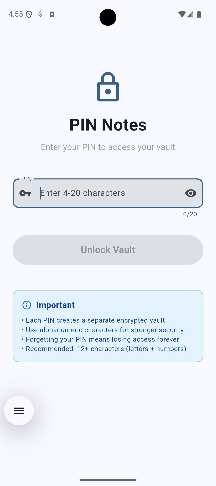
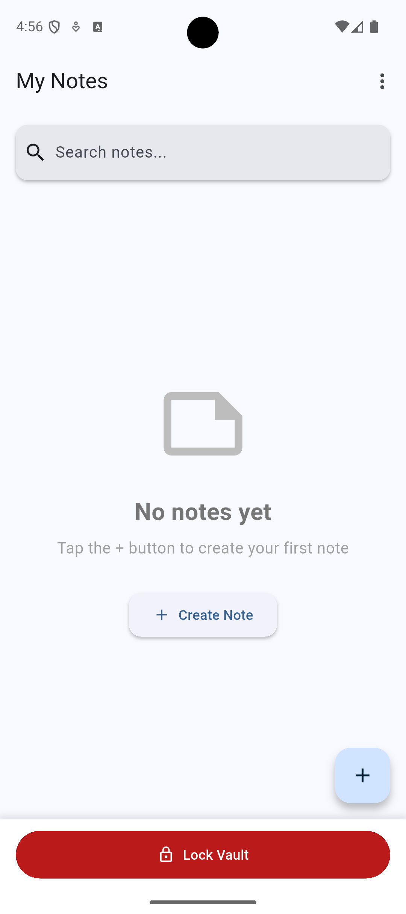
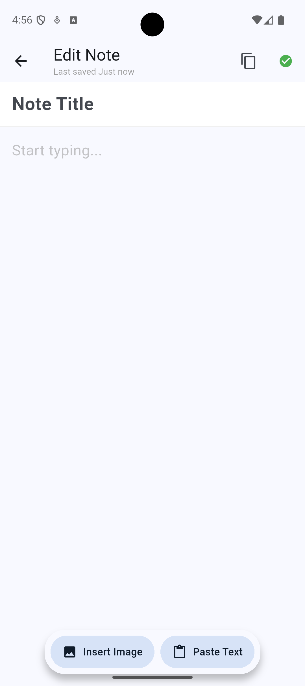
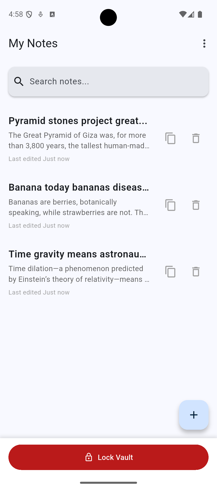

# PIN Notes

A secure, privacy-focused note-taking app for Android that uses a multi-vault model where each PIN protects a separate, encrypted collection of notes with rich text editing and on-device ML-powered features.

[](https://flutter.dev/)
[](https://opensource.org/licenses/MIT)
[](https://www.android.com/)

---

## Table of Contents

- [Overview](#overview)
- [Features](#features)
- [Screenshots](#screenshots)
- [Architecture](#architecture)
- [Security Model](#security-model)
- [Getting Started](#getting-started)
- [Building](#building)
- [Project Structure](#project-structure)
- [Recent Updates](#recent-updates)
- [Known Limitations](#known-limitations)
- [Security Considerations](#security-considerations)
- [Contributing](#contributing)
- [License](#license)

---

## Overview

PIN Notes is a lightweight, privacy-first Android application that provides military-grade encryption for your personal notes. Unlike traditional note apps that use a single password for all content, PIN Notes implements a **multi-vault architecture** where each unique PIN creates and unlocks a completely separate, encrypted database.

### What Makes PIN Notes Different?

- **🔒 True Multi-Vault Security**: Each PIN is a separate vault - not just different passwords for the same data
- **📵 100% Offline**: No internet permission, no cloud sync, no telemetry - your data never leaves your device
- **📝 Rich Text Editing**: Full-featured editor with formatting, images, and more
- **🚀 Zero Setup**: No account creation, no configuration - just enter a PIN and start writing
- **💾 Auto-Save**: Real-time saving ensures no data loss

---

## Features

### Core Functionality

- **Multi-Vault System**: Each PIN creates and unlocks a separate, independent vault for notes
- **Military-Grade Encryption**: SQLCipher with 256-bit AES encryption for all note data
- **Rich Text Editor**: Powered by Flutter Quill with support for:
  - Text formatting (bold, italic, underline, strikethrough)
  - Headers and lists
  - Image embedding with base64 encoding
  - Code blocks and quotes
  - Links and inline formatting
- **Auto-Lock Security**: Automatically locks when app goes to background
- **Auto-Save**: Real-time saving with debouncing to prevent data loss
- **Multiple Creation Flows**:
  - New blank note
  - Paste from clipboard
  - Image note (camera or gallery)
- **Swipe-to-Delete**: Intuitive gesture-based note deletion with confirmation
- **Last Edited Timestamps**: Track when notes were last modified
- **Alphanumeric PINs**: Support for strong 4-20 character PINs with letters, numbers, and symbols

### Privacy & Security

- **No Internet Permission**: App cannot access the network
- **Local-Only Storage**: All data stored in encrypted SQLite databases on device
- **No Analytics or Telemetry**: Zero tracking, zero data collection
- **Rate Limiting**: Prevents brute-force attacks against existing vaults
- **Automatic Locking**: Vault locks when app is backgrounded or closed
- **Separate Meta Database**: Unencrypted metadata for rate limiting without exposing vault data

---

## Screenshots

<p align="center">
  
  
  
  
</p>

<p align="center">
  <em>Left to Right: PIN Entry • Notes List • Rich Text Editor • Note with Image</em>
</p>

---

## Architecture

### Technology Stack

- **Framework**: Flutter 3.0+
- **Language**: Dart 3.0+
- **State Management**: Riverpod 2.5+ with Flutter Hooks 0.20+
- **Database**: SQLCipher (via sqflite_sqlcipher 3.1+)
- **Rich Text**: Flutter Quill 11.5+ with Extensions
- **Image Handling**: Image Picker 1.1+
- **Encryption**: 256-bit AES with PBKDF2 key derivation

### Architecture Decisions

#### 1. **Riverpod + Flutter Hooks for State Management**

**Why Riverpod?**
- Compile-time safety with better error messages than Provider
- No BuildContext dependency for provider access
- Better testability and modularity
- Automatic disposal of resources

**Why Flutter Hooks?**
- Reduces boilerplate for common patterns (controllers, listeners, effects)
- Composable state logic
- Better widget lifecycle management
- Natural integration with Riverpod via hooks_riverpod

**Key Providers:**
- `pinProvider`: Manages current vault PIN
- `vaultDbProvider`: Database connection lifecycle tied to PIN
- `notesNotifierProvider`: CRUD operations for notes
- `lifecycleObserverProvider`: App lifecycle monitoring for auto-lock
- `isSystemUiOpenProvider`: Prevents auto-lock during system interactions

#### 2. **Multi-Vault Model**

**Design Decision**: Instead of storing all notes in one encrypted database with different user credentials, each PIN creates a completely separate database file.

**Rationale:**
- **True Isolation**: Vaults are cryptographically independent
- **Plausible Deniability**: Multiple vaults appear as separate apps to casual inspection
- **Simpler Logic**: No user management, authentication, or access control needed
- **Better Security**: Compromise of one vault doesn't affect others

**Trade-offs:**
- PIN is used as both authentication and encryption key
- No "incorrect password" error - wrong PIN creates new vault
- Each vault has its own storage overhead

#### 3. **Flutter Quill for Rich Text**

**Why Flutter Quill?**
- Delta-based document format (compact JSON representation)
- Extensible architecture for custom embeds
- Active maintenance and community support
- Mobile-optimized toolbar and interactions
- Built-in undo/redo support

**Implementation Details:**
- Notes stored as JSON Delta format in database
- Images converted to base64 data URLs and embedded in Delta
- Custom toolbar configuration for mobile use
- Document controller lifecycle managed via hooks

#### 4. **Lifecycle Management**

**Auto-Lock Implementation:**

The app uses Flutter's `WidgetsBindingObserver` to monitor app lifecycle states:

```
resumed → App in foreground, vault unlocked
inactive → System dialog/overlay (image picker, etc.)
paused → App in background, vault should lock
detached → App being destroyed, vault should lock
```

**Challenge**: Image picker triggers `paused` state, causing vault to lock before image could be saved.

**Solution**: Introduced `isSystemUiOpenProvider` flag:
- Set to `true` before opening image picker
- Lifecycle observer checks flag before locking
- Cleared after picker closes
- All operations wrapped in try-catch for safety

**Additional Safeguards:**
- `context.mounted` checks after async operations
- Try-catch around all ref.read() calls to handle stale references
- Defensive programming against widget disposal during async gaps

---

## Security Model

### Encryption Details

**SQLCipher Configuration:**
- **Algorithm**: 256-bit AES encryption
- **Key Derivation**: PBKDF2 with SHA-512
- **Iterations**: 256,000 (SQLCipher 4 default)
- **Page Size**: 4096 bytes
- **HMAC**: SHA-512 for authentication

**Vault File Structure:**
```
/data/data/com.example.pin_notes/databases/
├── vault_1234.db          # Encrypted vault for PIN "1234"
├── vault_5678.db          # Encrypted vault for PIN "5678"
└── meta.db                # Unencrypted metadata for rate limiting
```

### PIN Security

**Current Implementation:**
- PIN can be any string (numeric or alphanumeric)
- No minimum length enforcement
- No complexity requirements
- PIN used directly as SQLCipher key
- PIN also used in filename (e.g., `vault_1234.db`)

**Security Implications:**
- ⚠️ **Weak PIN = Weak Encryption**: Short PINs vulnerable to brute force
- ⚠️ **Filename Exposure**: PIN visible in file listing if device compromised
- ✅ **Rate Limiting**: Meta database limits attempts (partial mitigation)

### Rate Limiting

**Mechanism:**
- Separate unencrypted `meta.db` tracks PIN attempt hashes
- Maximum of 10 unique PIN attempts per 24-hour period
- Prevents automated brute-force attacks
- Does not prevent manual entry attempts (by design for usability)

**Limitations:**
- ⚠️ Does not prevent dictionary attacks via filesystem manipulation
- ⚠️ Meta database can be deleted to reset counter
- ⚠️ Only tracks hashes, doesn't record success/failure

### Auto-Lock Mechanism

**How It Works:**
1. App lifecycle observer monitors `AppLifecycleState`
2. When app is paused/detached, PIN provider is cleared
3. Clearing PIN triggers database closure via provider disposal
4. Next app launch requires PIN re-entry

**Edge Cases Handled:**
- System UI (image picker, permissions) doesn't trigger lock
- Widget disposal during async operations gracefully handled
- Stale BuildContext references prevented with mounted checks

---

## Getting Started

### Prerequisites

- **Flutter SDK**: 3.0.0 or higher ([Install Flutter](https://flutter.dev/docs/get-started/install))
- **Android Studio** or **VS Code** with Flutter extensions
- **Android SDK**:
  - Min SDK: 26 (Android 8.0 Oreo)
  - Target SDK: 35 (Android 15)
  - Compile SDK: 35
- **Java**: Version 17 or higher
- **Android NDK**: 26.3+ (auto-installed during build)

### Installation

1. **Clone the repository**
   ```bash
   git clone https://github.com/yourusername/pinBasedNotes.git
   cd pinBasedNotes
   ```

2. **Install dependencies**
   ```bash
   flutter pub get
   ```

3. **Verify installation**
   ```bash
   flutter doctor
   ```
   Ensure all Android-related checks pass.

4. **Connect a device or start an emulator**
   ```bash
   flutter devices
   ```

5. **Run the app**
   ```bash
   flutter run
   ```

---

## Building

### Debug Build

For development with hot reload:
```bash
flutter run
```

### Release APK

1. **Build the APK**
   ```bash
   flutter build apk --release
   ```

2. **Output location**
   ```
   build/app/outputs/flutter-apk/app-release.apk
   ```

### App Bundle (for Play Store)

```bash
flutter build appbundle --release
```

### Signing Configuration

For production releases, configure signing in `android/key.properties`:

```properties
storePassword=<your-store-password>
keyPassword=<your-key-password>
keyAlias=<your-key-alias>
storeFile=<path-to-keystore>
```

---

## Project Structure

```
lib/
├── main.dart                          # App entry point, MaterialApp setup
├── data/
│   ├── db/
│   │   ├── vault_manager.dart         # Core vault encryption/decryption logic
│   │   └── meta_db_manager.dart       # Rate limiting metadata storage
│   └── models/
│       └── note.dart                   # Note data model with JSON serialization
├── providers/
│   ├── pin_provider.dart              # Current vault PIN state
│   ├── vault_db_provider.dart         # Database connection lifecycle
│   ├── notes_provider.dart            # Notes CRUD operations
│   └── lifecycle_provider.dart        # App lifecycle observation & auto-lock
├── services/
├── ui/
│   ├── screens/
│   │   ├── pin_entry_screen.dart      # PIN input and vault unlock
│   │   ├── notes_list_screen.dart     # Main notes list with FAB menu
│   │   └── editor_screen.dart         # Rich text editor with auto-save
│   └── widgets/
│       └── note_tile.dart              # Individual note list item
└── utils/
    └── date_format.dart                # Timestamp formatting utilities

android/
├── app/
│   ├── build.gradle.kts               # App-level Gradle configuration
│   └── src/main/AndroidManifest.xml   # Android permissions and config
└── build.gradle.kts                   # Project-level Gradle configuration

test/
└── widget_test.dart                   # Widget tests for UI components
```

### Key Files

#### `vault_manager.dart`
- Manages SQLCipher database connections
- Creates new vaults for new PINs
- Opens existing vaults with correct PIN
- Handles database schema migrations
- Core security implementation

#### `lifecycle_provider.dart`
- Monitors Flutter app lifecycle states
- Implements auto-lock when app backgrounded
- Prevents locking during system UI (image picker)
- Manages `isSystemUiOpenProvider` flag

#### `editor_screen.dart`
- QuillEditor integration with custom toolbar
- Auto-save with 500ms debouncing
- Image insertion (camera/gallery)
- Initial content loading (text/image)
- Auto-save with debouncing
- Document change tracking

#### `notes_list_screen.dart`
- Notes list with search/filter
- FAB with multiple creation options
- Swipe-to-delete with confirmation
- Note navigation
- Empty state handling

---

## Recent Updates

### v1.0.0 - Current Release

#### New Features
- ✨ **Rich Text Editor**: Full QuillEditor integration with formatting toolbar
- 🖼️ **Image Support**: Embed images from camera or gallery with base64 encoding
- 📋 **Clipboard Paste**: Quick note creation from clipboard content
- 📝 **Alphanumeric PINs**: Support for 4-20 character PINs with letters, numbers, symbols
- 💾 **Auto-Save**: Real-time saving with debouncing (500ms delay)
- 🗑️ **Swipe-to-Delete**: Gesture-based deletion with confirmation dialog
- 📱 **Multiple Creation Flows**: Blank note, clipboard paste, or image note
- ⏱️ **Last Edited Tracking**: Timestamp display for all notes

#### Bug Fixes
- 🔧 Fixed clipboard paste not inserting text into new notes
- 🔧 Fixed vault locking when image picker opened (system UI flag)
- 🔧 Fixed widget lifecycle assertion errors (mounted checks)
- 🔧 Fixed stale ref errors during async operations (try-catch wrappers)
- 🔧 Fixed image embed rendering (added QuillEditor extensions)
- 🔧 Fixed image note creation flow to pre-insert selected image
- 🔧 Fixed BuildContext async gap warnings (context.mounted checks)

#### Code Quality
- ✅ Fixed all test compilation errors (added onDeleteConfirmed parameter)
- ✅ Added flutter_localizations dependency
- ✅ Resolved all critical linter errors
- ⚠️ Remaining: 42 info-level warnings for debug print statements

#### Technical Improvements
- Defensive programming patterns for async/lifecycle edge cases
- Comprehensive error handling for ref access
- System UI interaction tracking to prevent premature vault locking
- Async image loading with `.then()` pattern for non-async contexts

---

## Known Limitations

### By Design

1. **No PIN Recovery**
   - Forgetting a PIN means permanent loss of vault access
   - No password reset, no recovery mechanism
   - Each vault is cryptographically independent

2. **No Cloud Sync**
   - All data stored locally only
   - No backup to cloud services
   - User responsible for device backups

3. **No Biometric Authentication**
   - PIN-only authentication
   - No fingerprint or face unlock support
   - Considered future enhancement

### Technical Limitations

1. **Base64 Image Storage**
   - Images stored as base64 in Delta JSON
   - Increases database size (~33% overhead)
   - Not optimal for large images or many images
   - Alternative: Separate file storage with encryption

2. **Debug Print Statements**
   - 42 `avoid_print` linter warnings
   - Print statements used throughout for debugging
   - Should be replaced with proper logging framework
   - Not a runtime issue, just code quality concern

3. **NDK Version Mismatches**
   - Build warnings about NDK versions (26 vs 27)
   - Cosmetic only - app builds and runs fine
   - Plugins request NDK 27, project uses 26
   - Backward compatible, no functional impact

4. **Single-Device Only**
   - No sync between devices
   - No export/import functionality
   - Vault tied to specific device

### Performance Considerations

1. **Large Image Handling**
   - Base64 encoding increases memory usage
   - Large images may cause UI lag
   - Consider image compression or size limits

2. **Database Size**
   - Quill Delta format is verbose
   - Many images can bloat database
   - No automatic cleanup or archiving

3. **Search Functionality**
   - Currently no full-text search
   - Only title-based filtering
   - Could be enhanced with FTS5

---

## Security Considerations

### Current Security Posture

✅ **Strong Points:**
- Military-grade SQLCipher encryption (256-bit AES)
- No network permissions (air-gapped by design)
- Auto-lock on app background
- Rate limiting against brute-force
- Local-only storage (no cloud exposure)
- Multi-vault isolation

⚠️ **Areas of Concern:**

#### 1. **Weak PIN Vulnerability**

**Issue**: No enforcement of PIN strength or length.

**Attack Vector**:
- 4-digit numeric PIN has only 10,000 combinations
- Can be brute-forced offline if device compromised

**Mitigations:**
- Rate limiting (10 attempts/24hr) for live attacks
- User education about strong PINs
- Consider enforcing minimum length (future)

**Residual Risk**:
High if user chooses weak PIN and device is physically compromised.

#### 2. **PIN Exposure in Filename**

**Issue**: Vault filename contains PIN (e.g., `vault_1234.db`).

**Attack Vector**:
- If attacker gains filesystem access, PIN is visible
- Reduces security to file encryption only
- Leaks information about existing vaults

**Potential Mitigations**:
- Use hashed filenames (breaks multi-vault transparency)
- Use UUIDs with separate mapping (adds complexity)
- Encrypt filename storage location (difficult on Android)

**Residual Risk**:
Medium - requires filesystem access but trivializes PIN guessing.

#### 3. **No Secure Deletion**

**Issue**: Deleted notes may remain in database files or flash memory.

**Attack Vector**:
- Forensic recovery tools can retrieve "deleted" data
- SQLite VACUUM not automatically run
- Flash wear-leveling preserves old data

**Potential Mitigations**:
- Implement VACUUM on vault close
- Overwrite deleted data with random bytes
- Use secure deletion APIs (limited on Android)

**Residual Risk**:
Low to Medium - requires forensic tools and physical access.

#### 4. **Screenshot and Screen Recording**

**Issue**: No protection against screenshots or screen recording.

**Attack Vector**:
- User or malware can capture note content
- Bypasses encryption entirely
- Screen recording in background

**Potential Mitigations**:
- Set FLAG_SECURE on activity windows
- Detect screen recording (limited reliability)
- User awareness/warnings

**Residual Risk**:
Medium - trivial attack if device is unlocked.

#### 5. **Memory Dumping**

**Issue**: Decrypted notes stored in app memory while editing.

**Attack Vector**:
- Root access allows memory dumps
- Debugging tools can inspect process memory
- Crash dumps may contain plaintext

**Potential Mitigations**:
- Minimize plaintext lifetime in memory
- Overwrite sensitive buffers on disposal
- Prevent debugging in release builds

**Residual Risk**:
Low - requires root access or debugging.

#### 6. **Clipboard Exposure**

**Issue**: Clipboard content not cleared after paste.

**Attack Vector**:
- Other apps can read clipboard
- Sensitive data may linger
- Cross-app information leakage

**Potential Mitigations**:
- Clear clipboard after paste (may annoy users)
- Warn users about clipboard sensitivity
- Use Android 10+ clipboard notifications

**Residual Risk**:
Low to Medium - depends on user clipboard habits.

#### 7. **Backup Exposure**

**Issue**: Android backups may include databases.

**Attack Vector**:
- ADB backups could extract databases
- Cloud backups (if enabled) upload encrypted DBs
- Backup is only as secure as backup storage

**Potential Mitigations**:
- Set android:allowBackup="false" (already done)
- Use Android Auto Backup exclusions
- Encrypt backups separately

**Residual Risk**:
Low - backups disabled, but user can enable via ADB.

### Security Recommendations

**For Users:**
1. Use strong, alphanumeric PINs (12+ characters recommended)
2. Don't share your device while app is unlocked
3. Enable device encryption (Android 5.0+)
4. Use strong device lock screen password
5. Keep device physically secure
6. Regular device backups (but understand risks)

**For Developers:**
1. Implement FLAG_SECURE to prevent screenshots
2. Add PIN strength meter and enforcement
3. Use hashed vault filenames
4. Implement secure deletion (VACUUM on close)
5. Add biometric authentication option
6. Consider memory protection techniques
7. Add export/import with separate encryption
8. Implement secure clipboard handling
9. Add integrity checking for vault files
10. Consider hardware-backed keystore integration

### Threat Model

**Assumes Protected Against:**
- ✅ Network-based attacks (no network access)
- ✅ Casual device snooping (auto-lock)
- ✅ Online brute-force (offline-only, rate-limited)
- ✅ Data breach at server (no server)

**Does NOT Protect Against:**
- ❌ Physical device compromise with root access
- ❌ Advanced forensic analysis of device storage
- ❌ Malware running with app permissions
- ❌ User choosing weak PIN (4-digit numeric)
- ❌ Sophisticated memory dumping attacks
- ❌ Supply chain attacks on dependencies

**Recommended Use Cases:**
- Personal notes, journaling, ideas
- Sensitive but not life-critical information
- Privacy from casual access
- Local-only data storage

**NOT Recommended For:**
- National security secrets
- Life-or-death information
- High-value financial data
- Situations requiring perfect forward secrecy
- Environments with advanced persistent threats (APTs)

---

## Dependencies

### Production Dependencies

```yaml
# State Management
hooks_riverpod: ^2.5.2          # Riverpod with hooks integration
flutter_hooks: ^0.20.5           # React-like hooks for Flutter

# Database & Encryption
sqflite_sqlcipher: ^3.1.1        # SQLCipher for encrypted SQLite
path_provider: ^2.1.4            # Access to app directories
path: ^1.9.0                     # Path manipulation utilities
crypto: ^3.0.3                   # Cryptographic functions

# Rich Text Editor
flutter_quill: ^11.5.0           # Quill editor for Flutter
flutter_quill_extensions: ^11.0.0 # Image/video support for Quill
dart_quill_delta: ^10.8.3        # Delta document format

# Utilities
uuid: ^4.5.1                     # UUID generation for notes
intl: ^0.19.0                    # Internationalization
image_picker: ^1.1.2             # Image selection from camera/gallery

# Machine Learning
tflite_flutter: ^0.10.4          # TensorFlow Lite (not currently used)
```

### Android-Specific Dependencies

```gradle
// No ML dependencies currently
// No ML dependencies currently
```

### Development Dependencies

```yaml
flutter_test:
  sdk: flutter
flutter_lints: ^4.0.0            # Linting rules
```

---

## Testing

### Running Tests

```bash
# Run all tests
flutter test

# Run with coverage
flutter test --coverage

# Run specific test file
flutter test test/widget_test.dart
```

### Test Coverage

Current test coverage focuses on widget tests for UI components:
- ✅ NoteTile widget rendering
- ✅ Note deletion dialog
- ✅ Swipe-to-delete functionality

**Areas Needing Tests:**
- Unit tests for VaultManager
- Integration tests for note CRUD
- Widget tests for editor screen
- Provider tests for state management

---

## Contributing

Contributions are welcome! Please follow these guidelines:

### Getting Started

1. Fork the repository
2. Create a feature branch (`git checkout -b feature/amazing-feature`)
3. Commit your changes (`git commit -m 'Add amazing feature'`)
4. Push to the branch (`git push origin feature/amazing-feature`)
5. Open a Pull Request

### Code Standards

- Follow [Effective Dart](https://dart.dev/guides/language/effective-dart) guidelines
- Run `flutter analyze` before committing
- Ensure all tests pass (`flutter test`)
- Add tests for new features
- Update documentation for API changes
- Remove debug print statements before PR

### Areas for Contribution

**High Priority:**
- [ ] Implement FLAG_SECURE for screenshot prevention
- [ ] Add biometric authentication option
- [ ] Implement proper logging framework (replace print)
- [ ] Add export/import functionality
- [ ] Improve image storage (separate encrypted files)
- [ ] Add full-text search capability

**Medium Priority:**
- [ ] PIN strength enforcement
- [ ] Hashed vault filenames
- [ ] Secure deletion (VACUUM on close)
- [ ] Memory protection techniques
- [ ] Vault integrity checking
- [ ] Tablet/landscape layout optimization

**Low Priority:**
- [ ] Dark mode theme
- [ ] Note categories/tags
- [ ] Rich text formatting shortcuts
- [ ] Undo/redo UI controls
- [ ] Note templates
- [ ] Markdown import/export

---

## Troubleshooting

### Common Issues

**Q: I entered my PIN and my notes are gone!**
- You may have accidentally typed a new PIN, creating a new vault
- Carefully re-enter your original PIN
- Each PIN opens a different vault

**Q: Build fails with Gradle errors**
- Ensure Java 17+ is installed: `java -version`
- Clean build: `flutter clean && flutter pub get`
- Check Android SDK installation: `flutter doctor`

**Q: Images not displaying in notes**
- Ensure flutter_quill_extensions is installed
- Check that embedBuilders are configured in QuillEditor
- Verify image file access permissions

**Q: App locks while using image picker**
- This was a known issue, now fixed
- Update to latest version
- Ensure isSystemUiOpenProvider logic is present

**Q: NDK version warnings during build**
- These are cosmetic warnings only
- App builds and runs correctly despite warnings
- Plugins request NDK 27, project uses NDK 26 (backward compatible)

### Debug Mode

Enable verbose logging in debug builds:
```bash
flutter run --verbose
```

Check app logs:
```bash
flutter logs
```

---

## Performance Tips

### For Users

1. **Limit Image Sizes**: Large images increase database size and slow performance
2. **Regular Cleanup**: Delete old notes you don't need
3. **Avoid Excessive Formatting**: Keep notes simple for better performance
4. **Close Unused Vaults**: Lock app when not in use to free memory

### For Developers

1. **Image Compression**: Implement image compression before base64 encoding
2. **Lazy Loading**: Paginate notes list for large vaults
3. **Database Optimization**: Add indexes for frequently queried fields
4. **Memory Management**: Dispose controllers and streams properly
5. **Build Optimization**: Use --release flag for production APKs

---

## Roadmap

### Version 1.1 (Planned)
- [ ] Screenshot prevention (FLAG_SECURE)
- [ ] Biometric authentication
- [ ] Export/import functionality
- [ ] Proper logging framework

### Version 1.2 (Planned)
- [ ] Full-text search
- [ ] Note categories/tags
- [ ] Image compression
- [ ] Dark mode

### Version 2.0 (Future)
- [ ] Encrypted cloud sync (optional)
- [ ] Desktop app (Windows/Mac/Linux)
- [ ] Hardware keystore integration
- [ ] Advanced security audit mode

---

## FAQ

**Q: Is this app secure enough for sensitive data?**
A: It uses military-grade encryption (SQLCipher), but security depends on PIN strength and physical device security. See [Security Considerations](#security-considerations) for details.

**Q: Can I recover my notes if I forget the PIN?**
A: No. This is by design - there is no recovery mechanism. Choose a memorable PIN or keep a secure backup.

**Q: Does this app collect any data?**
A: No. The app has no internet permission and collects zero telemetry or analytics.

**Q: Can I sync my notes across devices?**
A: Not currently. This is a planned feature with optional encrypted cloud sync.

**Q: Why does the app require Google Play Services?**

**Q: How do I backup my vaults?**
A: Currently, you must backup the entire app data folder via device backup. Proper export/import is planned.

---

## Acknowledgments

- **SQLCipher** - Zetetic LLC for encrypted SQLite
- **Flutter** - Google for the amazing framework
- **Quill** - Flutter Quill team for rich text editing
- **Riverpod** - Remi Rousselet for state management
- **Flutter Hooks** - Remi Rousselet for hooks implementation

---

## License

MIT License

Copyright (c) 2025

Permission is hereby granted, free of charge, to any person obtaining a copy
of this software and associated documentation files (the "Software"), to deal
in the Software without restriction, including without limitation the rights
to use, copy, modify, merge, publish, distribute, sublicense, and/or sell
copies of the Software, and to permit persons to whom the Software is
furnished to do so, subject to the following conditions:

The above copyright notice and this permission notice shall be included in all
copies or substantial portions of the Software.

THE SOFTWARE IS PROVIDED "AS IS", WITHOUT WARRANTY OF ANY KIND, EXPRESS OR
IMPLIED, INCLUDING BUT NOT LIMITED TO THE WARRANTIES OF MERCHANTABILITY,
FITNESS FOR A PARTICULAR PURPOSE AND NONINFRINGEMENT. IN NO EVENT SHALL THE
AUTHORS OR COPYRIGHT HOLDERS BE LIABLE FOR ANY CLAIM, DAMAGES OR OTHER
LIABILITY, WHETHER IN AN ACTION OF CONTRACT, TORT OR OTHERWISE, ARISING FROM,
OUT OF OR IN CONNECTION WITH THE SOFTWARE OR THE USE OR OTHER DEALINGS IN THE
SOFTWARE.

---

## Disclaimer

This app is provided as-is, without warranty of any kind. While we use industry-standard encryption (SQLCipher with 256-bit AES), no security system is perfect. Please:

- Choose strong PINs (12+ alphanumeric characters recommended)
- Keep your device physically secure
- Understand that forgetting a PIN means permanent data loss
- Don't use for life-critical or national security information
- Keep device backups (but understand the security implications)
- Read the [Security Considerations](#security-considerations) section carefully

**The developers are not responsible for data loss, security breaches, or any damages arising from the use of this software.**

---

## Contact

For issues, questions, or suggestions:
- **Issues**: [GitHub Issues](https://github.com/yourusername/pinBasedNotes/issues)
- **Discussions**: [GitHub Discussions](https://github.com/yourusername/pinBasedNotes/discussions)
- **Security**: For security vulnerabilities, please email [security@example.com] rather than filing public issues

---

**Built with Flutter** | **Secured with SQLCipher** | **Privacy First** | **100% Offline**

*Your notes. Your device. Your privacy.*
